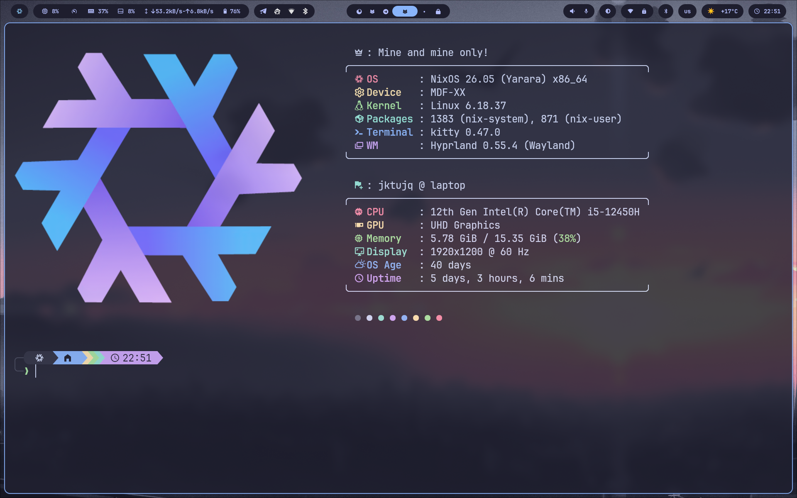
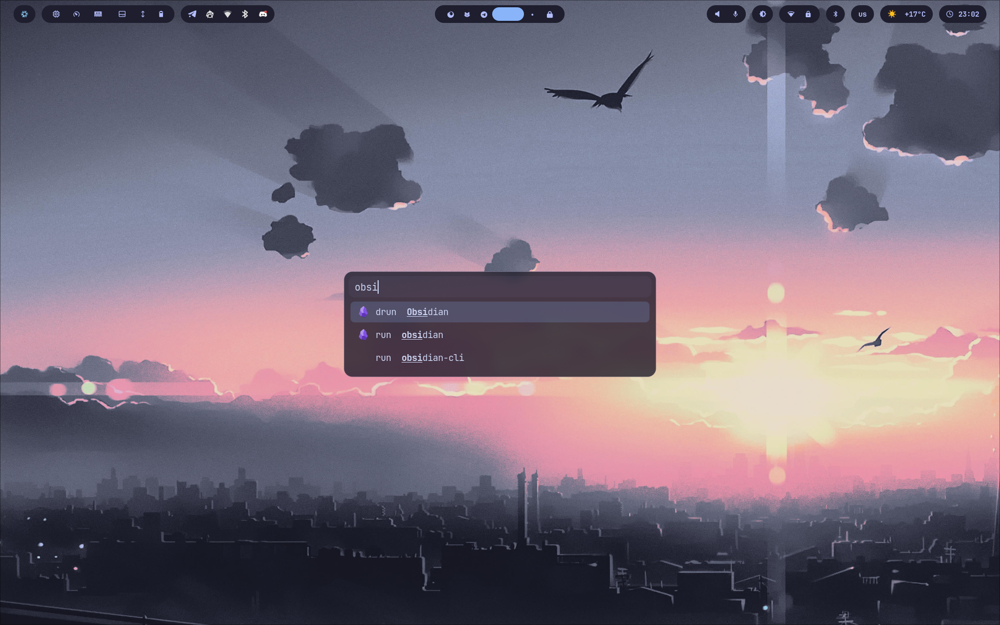

# ❄️ My Nix Configuration

A modular, full-featured Nix configuration for NixOS and nix-darwin, built with flakes.
This configuration provides a complete and consistent environment across all my machines - from a fully riced desktop, to a minimal server setup.
Everything is made to be easily extendable, maintainable, and reproducible.

## ✨ Features

- **Modular & Flexible** — Everything is organized as reusable modules for *nixos*, *nix-darwin*, and *home-manager*. You can pick exactly what you need by adjusting imports - no unnecessary bloat.

- **Multiple Hosts & Users** — Drop a new folder in `hosts/` and it's automatically discovered. User configurations are just as easy to manage and extend.

- **Development Shells** — Pre-configured development environments for different languages. Spin up a shell with everything you need for any project.

- **Theming & Ricing** — A cohesive, theme-driven approach to styling. The entire visual experience is built around a consistent color scheme, making ricing seamless and maintainable.

- **Secrets Management** — Encrypted secrets with agenix, integrated with host SSH keys for secure, declarative management of sensitive data.

- **Deploy** — Reproducible configurations that can be deployed anywhere with ease. Whether it's a fresh VPS or a new machine, disko and nixos-anywhere make installation straightforward.

## 📷 Screenshots






## 📖 Usage

Everything is organized around three core concepts: **hosts**, **users**, and **modules**.

### Adding a new host

1. Create a folder in `hosts/` with the naming convention `<system>__<hostname>`:
   - `x86_64-linux__laptop` - NixOS host
   - `aarch64-darwin__macbook` - nix-darwin host

2. Inside, create a `configuration.nix`:

```nix
{
  imports = [
    ./hardware_configuration.nix
  ];

  # the rest of your configuration...
}
```

3. The host is automatically discovered - it is just simple `configuration.nix` pattern supported by the flake.

### Adding a user

All files from `users/` inside a host folder are automatically registered as users.
This makes it easy to keep user configurations separate and organized.

Users are defined by a function that takes username and then just returns plain Nix module.
After currying (username is taken from the filename) it is imported alongside with respectable host configuration.

```nix
username:
{
  homeModulesDir,
  ...
}:
{
  users.users.${username} = {
    isNormalUser = true;
    home = "/home/${username}";
    extraGroups = [
      "wheel"
    ];
  };

  home-manager.users.${username} = {
    imports = [
      (homeModulesDir + "terminal/cli/nh.nix")
    ]
  }
];
```

### Using modules

Modules are split by purpose:

- `modules/nixos/` - system-level configuration (boot, networking, services)
- `modules/darwin/` - macOS-specific system modules
- `modules/home/` - user-level configuration (shells, CLI tools, applications)

They implement a piece of feature - just import them:

```nix
imports = [
  (nixosModulesDir + "system/boot.nix")
  (nixosModulesDir + "networking/network-manager.nix")
];
```

The following directories are available through `specialArgs` and can be used in any module:

| Variable | Path |
|----------|------|
| `nixosModulesDir` | `modules/nixos/` |
| `darwinModulesDir` | `modules/darwin/` |
| `homeModulesDir` | `modules/home/` |
| `assetsDir` | `assets/` |
| `secretsDir` | `secrets/` |

All modules are designed to be self-contained and reusable across different hosts and users.

## 🔨 Tooling

### Deployment

This configuration includes tooling for reproducible, automated deployment on new machines.

- **disko** - Declarative disk partitioning. Define your disk layout once in `disko-configuration.nix` and apply it with a single command.
- **nixos-anywhere** - Install NixOS on remote machines via SSH. Works with disko and hardware generation out of the box.
- **agenix** - Transfer and use your passwords on new machine with ease. With nixos-anywhere ability to copy host keys or to place your own you could automate the process of setup entirely.

Together, they make setting up a new server or VPS a one-command process.

### Development Shells & Templates

Pre-configured environments for different languages are available as flake templates.
Spin up isolated environments with all dependencies for a specific stack. Shells are defined in `dev-shells/`.

```bash
nix flake init -t .#python
# or
nix flake new -t .#rust my-rust-project
```

All templates are designed to be minimal and easily extendable. Add or remove packages as needed.

## 🏠 Standalone Home-Manager

Standalone home-manager is **not supported** in this repository.
The configuration is designed for home-manager as a NixOS module.

If you want to use it standalone:

1. Set it up using the [official home-manager template](https://nix-community.github.io/home-manager/index.html#sec-flakes-standalone).
2. Point `homeModulesDir` to this repository's `modules/home/` folder to reuse existing modules:

```nix
extraSpecialArgs = {
  homeModulesDir = "/path/to/this/repo/modules/home";
};
```

That's it - all modules from `modules/home/` become available for import in your standalone config.

## ❤️ Acknowledgements

Made by [@JktuJQ](https://github.com/JktuJQ) — feel free to open an issue or reach out. Contributions and suggestions are welcome.
